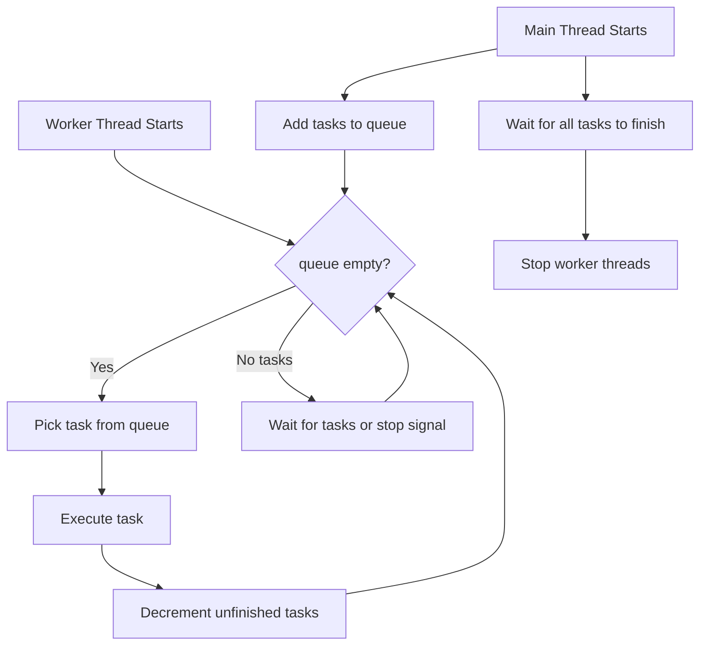

- **Spinning版本**：线程会不停地检查是否有任务可执行，会占用CPU资源。
- **Sleeping版本**：线程在没有任务时会睡眠，等待被唤醒，从而节省CPU资源。

```mermaid
graph TD
    A[Worker Thread Starts] --> B{ queue empty?}
    B -->|Yes| C[Pick task from queue]
    C --> D[Execute task]
    D --> E[Decrement unfinished tasks]
    E --> B
    B -->|No tasks| F[Wait for tasks or stop signal]
    F --> B
    G[Main Thread Starts] --> H[Add tasks to queue]
    H --> B
    G --> I[Wait for all tasks to finish]
    I --> J[Stop worker threads]
```