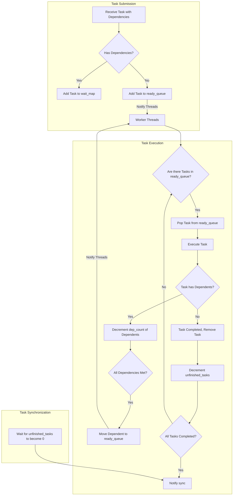

### 流程说明：
1. **任务提交阶段（Task Submission）**：
   - 当一个任务通过 `runAsyncWithDeps()` 被提交时，首先判断该任务是否有依赖。
   - 如果有依赖，该任务会被加入到 `wait_map` 中，等待依赖任务完成。
   - 如果没有依赖，任务会被直接放入 `ready_queue`，并通知工作线程可以开始执行该任务。

2. **任务执行阶段（Task Execution）**：
   - 工作线程从 `ready_queue` 中取出任务并执行。
   - 任务执行完后，如果有依赖它的其他任务，依赖任务的 `dep_count` 会减少。当所有依赖任务都完成时，该依赖任务会被移入 `ready_queue`，准备执行。
   - 当一个任务完成后，系统会减少 `unfinished_tasks` 计数。

3. **任务同步阶段（Task Synchronization）**：
   - `sync()` 函数通过 `condition_variable` 等待所有任务完成（`unfinished_tasks` 变为 0），此时主线程可以被通知并继续执行。

### 调整重点：
- **依赖任务处理**：在任务提交时，通过 `wait_map` 和 `dep_count` 记录依赖关系。执行任务时，依赖任务的状态会动态更新。
- **线程池工作逻辑**：工作线程从 `ready_queue` 中取任务，执行完任务后，检查并处理与该任务相关的依赖任务。
- **同步机制**：`sync()` 函数通过条件变量等待所有任务完成后继续执行。

这样通过流程图可以帮助你更直观地理解任务系统中线程池、任务依赖和同步的运作方式。如果有任何进一步的问题或细节需要调整，可以继续优化流程图。